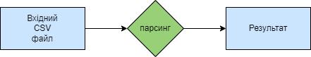

## CSV_PARSER

Creates.io = https://crates.io/crates/csv_parser_moshkovskyi

Docs.rs = https://docs.rs/csv_parser_moshkovskyi/latest/csv_parser_moshkovskyi/

## General description
This is an implementation of a basic CSV parser in Rust.

## Technical description of parsing process
This project provides an efficient tool for parsing CSV files.  
It supports:  
- Reading CSV files and validating their structure.   
- Returning structured data for further processing or analysis.

---

## Features
- **Header Support**: Automatically recognizes and processes headers.  
- **Field Types**: Handles empty, quoted, and unquoted fields.  
- **Error Handling**: Detects and reports incorrect CSV formatting.  
- **Simple Integration**: Easily integrates with Rust projects for data processing tasks.

---

## Technical Details
The parser processes CSV files line by line. It:  
1. Opens the file using `std::fs::File`.  
2. Uses `csv::ReaderBuilder` to handle CSV-specific rules (headers, delimiters, etc.).  
3. Iterates through rows and prints records in a structured format.

---

## Usage
### Input File (`test.csv`):
```csv
"name","age","city"
"John Doe",30,"New York"
"Jane Smith",25,"Los Angeles"
"Sam Brown",22,"Chicago"
```

### Output:
Record { 0: "Alice", 1: "30", 2: "New York" }

Record { 0: "Bob", 1: "25", 2: "San Francisco" }

Record { 0: "Charlie", 1: "35", 2: "Los Angeles" }

---

---

## Grammar
- **WHITESPACE**: Represents spaces, tabs, newlines, and carriage returns. Used for ignoring whitespace within the CSV file.
    ```rust
    WHITESPACE = _{ " " | "\t" | "\n" | "\r" }
    ```

- **NEWLINE**: Represents line breaks in Unix and Windows styles.
    ```rust
    NEWLINE = _{ "\n" | "\r\n" }
    ```

- **csv**: The main rule for parsing a CSV file. It allows for optional whitespace or newlines at the beginning, followed by one or more `record` entries separated by newlines, and optional whitespace or newlines after the last record. This rule defines that a CSV file can have leading and trailing line breaks.
    ```rust
    csv = { (WHITESPACE | NEWLINE)* ~ record ~ (NEWLINE ~ record)* ~ (WHITESPACE | NEWLINE)* }
    ```

- **record**: Defines a CSV record, which consists of one or more fields separated by commas. Each field is processed according to the `field` rule.
    ```rust
    record = { field ~ ("," ~ field)* }
    ```

- **field**: A field in the CSV file, which can be empty (`empty_field`), quoted (`quoted_field`), or unquoted (`unquoted_field`).
    ```rust
    field = { empty_field | quoted_field | unquoted_field }
    ```

- **empty_field**: Represents an empty field, indicated by a single comma without any value. This is used when a field is empty.
    ```rust
    empty_field = _{ "," }
    ```

- **quoted_field**: Represents a field enclosed in double quotes (`"`), allowing commas or other quotes to be included in the field. For example, `"value with quotes ""inside"""` will be parsed as a single field. Double quotes inside the field represent a single quote in the final value.
    ```rust
    quoted_field = _{ "\"" ~ (!"\"" ~ ANY | "\"" ~ "\"")* ~ "\"" }
    ```

- **unquoted_field**: Represents a field that is not enclosed in quotes and does not contain commas or newlines. It allows any character except delimiters (`,` , spaces, and `NEWLINE`).
    ```rust
    unquoted_field = _{ (!("," | NEWLINE | " ") ~ ANY)+ }
    ```